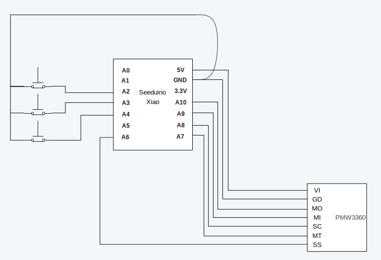

# PMW3360-Seeeduino-Trackball-Mouse
Connecting PMW3360 sensor to a Seeeduino XIAO

This mouse implements a "scroll layer" by holding down the scroll button the mouse will switch to scrolling when the trackball is moved.

### BOM:
- [PMW3360 Motion Sensor](https://www.tindie.com/products/jkicklighter/pmw3360-motion-sensor/)
- [Seeed Studio XIAO SAMD21](https://www.seeedstudio.com/Seeeduino-XIAO-Arduino-Microcontroller-SAMD21-Cortex-M0+-p-4426.html)
- Wires
  - For cleanliness, I connected to the PMW3360 using some [flat ribbon cable](https://www.amazon.com/dp/B088M5KJ4F)

### Setup for PMW3360 <> Seeeduino Xiao

- VI -> 5V
- GD -> GND
- MO -> A10/D10/MOSI
- MI -> A9/D9/MISO
- SC -> A8/D8/SCK
- MT -> A7/D7/RX (NOTE: since I'm polling the mouse, this isn't really necessary)
- SS -> A6/D6/TX

### Setup for the buttons

- GND -> Button -> A2/D2
- GND -> Button -> A3/D3
- GND -> Button -> A4/D4

### Wiring Diagram

### Legal

This code is largely based on https://github.com/mrjohnk/PMW3360DM-T2QU but the library code was extracted to have a cleaner API.